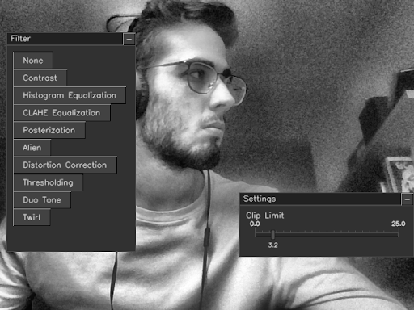
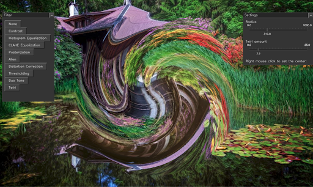
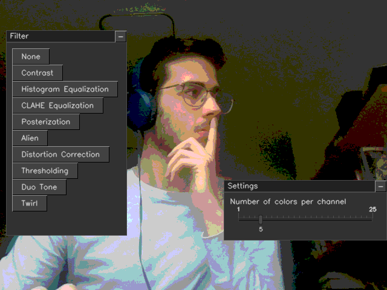
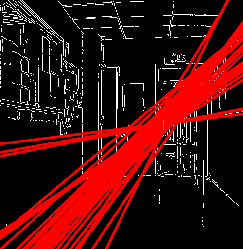
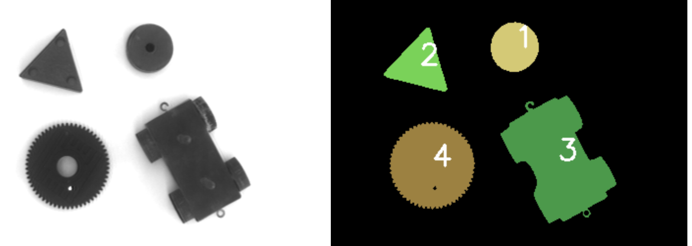
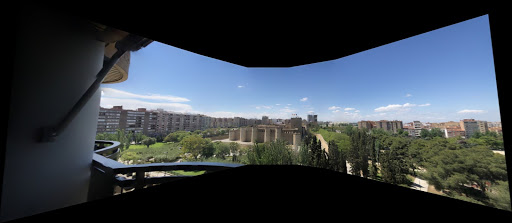

# Visión por computador
* Autor: Alejandro Paricio García
* Autor: Fernando Peña Bes

*Visión por computador - Universidad de Zaragoza*

# Descripción
El repositorio contiene 4 proyectos relacionados con la visión por computador:
    
* Efectos: Implementa un conjunto de efectos visuales aplicados a imágenes obtenidas en vivo seleccionables mediante una interfaz gráfica. Detalles consultables en el [informe](doc/Informe_1.pdf).

* Obtención del punto de fuga: Implementa la detección y obtención de líneas de contorno y el posterior cálculo del punto de fuga. Detalles consultables en el [informe](doc/Informe_2.pdf).

* Reconocimiento de objetos: Implementa un clasificador mediante aprendizaje supervisado, detalles en el [informe](doc/Informe_3.pdf).

* Creación de panoramas: Implementa la fusión de múltiples imágenes parcialmente solapadas en una única imagen. Detalles consultables en el [informe](doc/Informe_4.pdf).

# Resultados

* Efectos

|Efecto CLAHE|Efecto Twirl|Efecto Posterize|
|:---:|:---:|:---:|
||||

* Obtención del punto de fuga

* Reconocimiento de objetos

* Creación de panoramas

# Dependencias
Para la correcta ejecución de los proyectos se requiere la instalación de la librería
OpenCV para C++.